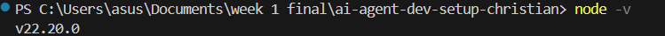
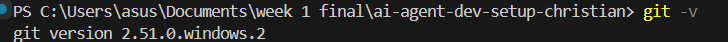
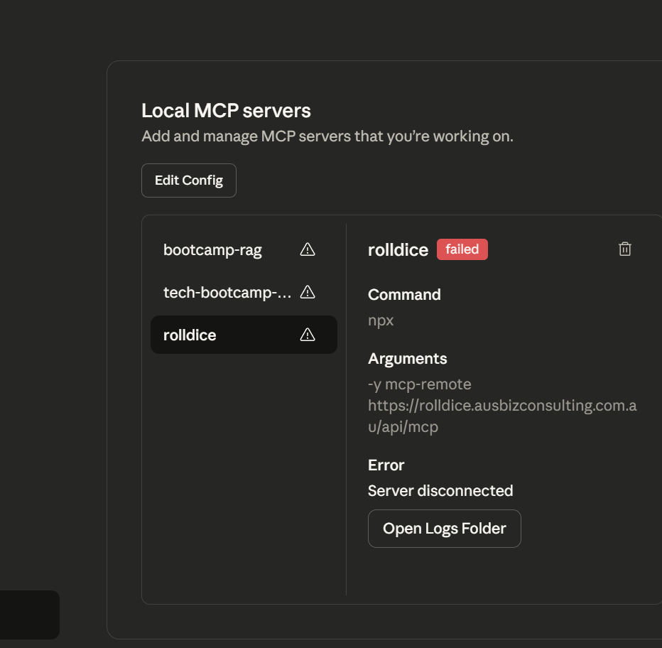

# AI Agent Development Environment Setup - CHRISTIAN JAY MAQUIRAYA

**Workshop Cohort:** AI Agent Bootcamp November 2025

## Development Environment Checklist

### ✅ Node.js installed
**Screenshot:**

 
 
### ✅ Git installed
**Screenshot:**

 
 
### ✅ Claude Desktop open with all 4 MCP servers connected
**Screenshot:**

## MCP Servers Purpose

- **Rolldice:** AI agent for gaming automation
- **Bootcamp AI Agent:** Training assistant and code helper
- **Calendar Booking:** Manages scheduling and appointments
- **GitHub MCP Server:** Connects AI tools to version control and repository management

## Troubleshooting Notes

- Encountered Git issues on Windows PowerShell. Fixed by installing Git Bash and setting proper remote URLs
- Node.js and VS Code Insider required updates to work with MCP integrations
- Claude Desktop required re-login after updates to recognize all MCP servers

